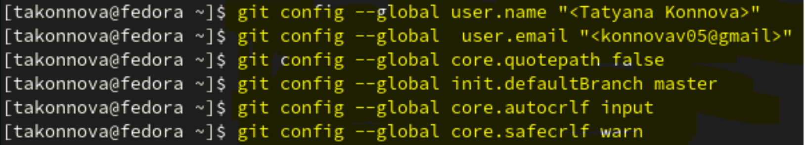
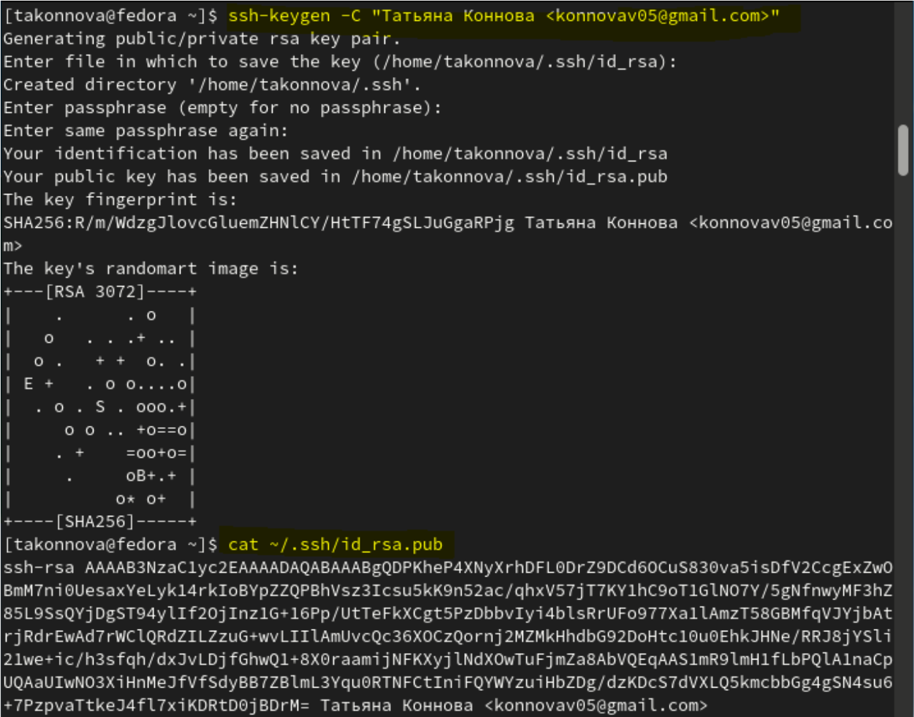
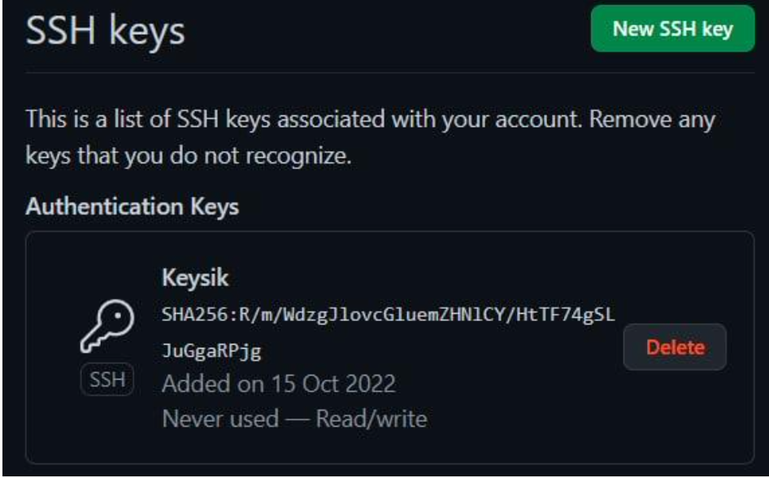
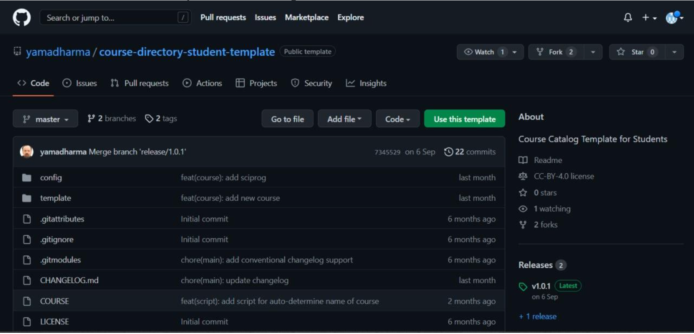
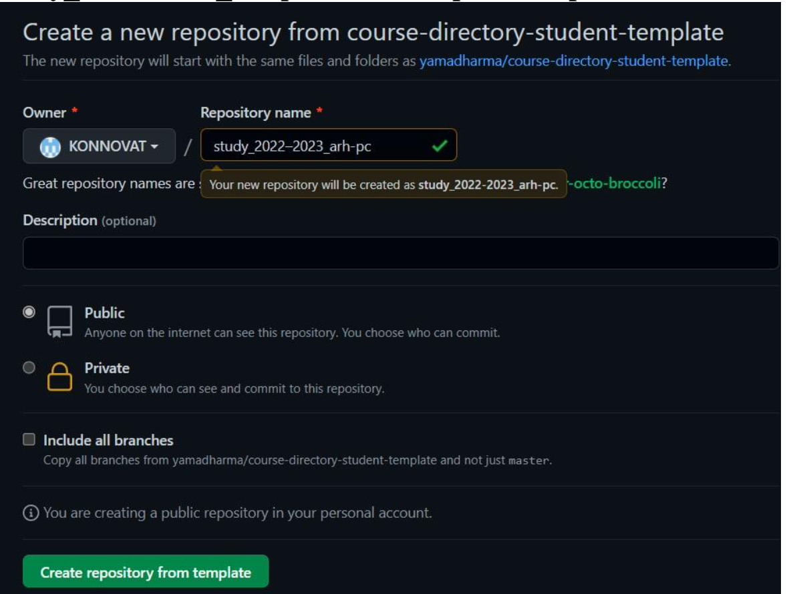
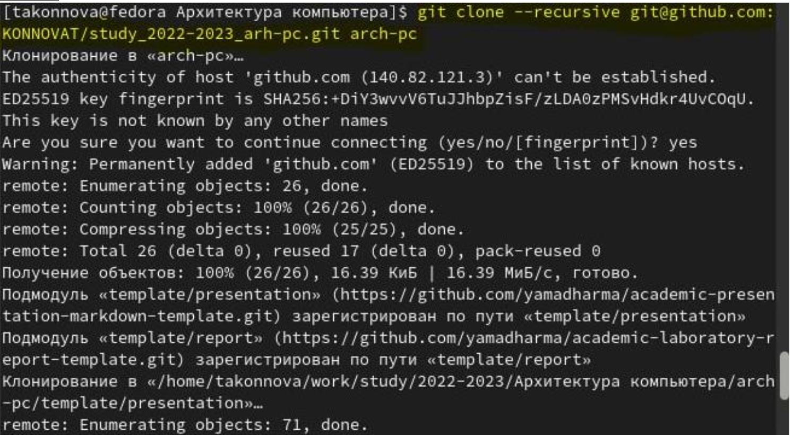
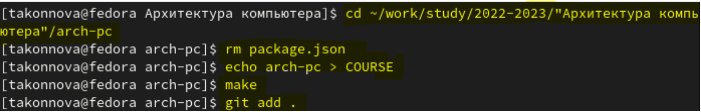
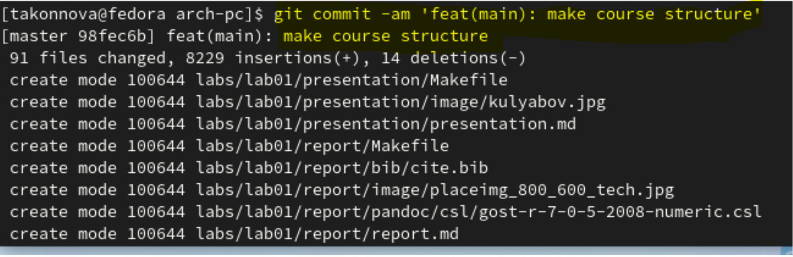
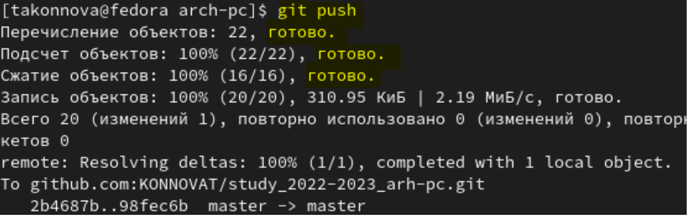
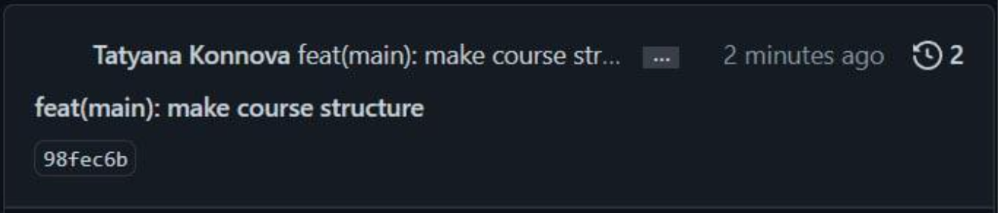

---
## Front matter
title: "Отчёт по лабораторной работе №3"
subtitle: "дисциплина: Архитектура компьютера"
author: "Коннова Татьяна Алексеевна"

## Generic otions
lang: ru-RU
toc-title: "Содержание"

## Pdf output format
toc: true # Table of contents
toc-depth: 2
lof: true # List of figures
fontsize: 12pt
linestretch: 1.5
papersize: a4
documentclass: scrreprt
## I18n polyglossia
polyglossia-lang:
  name: russian
  options:
	- spelling=modern
	- babelshorthands=true
polyglossia-otherlangs:
  name: english
## I18n babel
babel-lang: russian
babel-otherlangs: english
## Fonts
mainfont: PT Serif
romanfont: PT Serif
sansfont: PT Sans
monofont: PT Mono
mainfontoptions: Ligatures=TeX
romanfontoptions: Ligatures=TeX
sansfontoptions: Ligatures=TeX,Scale=MatchLowercase
monofontoptions: Scale=MatchLowercase,Scale=0.9
## Biblatex
biblatex: true
biblio-style: "gost-numeric"
biblatexoptions:
  - parentracker=true
  - backend=biber
  - hyperref=auto
  - language=auto
  - autolang=other*
  - citestyle=gost-numeric
## Pandoc-crossref LaTeX customization
figureTitle: "Рис."
lofTitle: "Список иллюстраций"
## Misc options
indent: true
header-includes:
  - \usepackage{indentfirst}
  - \usepackage{float} # keep figures where there are in the text
  - \floatplacement{figure}{H} # keep figures where there are in the text
---

# Цель работы
Целью работы является изучить идеологию и применение средств контроля версий и приобрести практические навыки по работе с системой git.

# Выполнение лабораторной работы
Настройка github
Существует несколько доступных серверов репозиториев с возможностью бесплатного размещения данных. Например, http://bitbucket.org/, https://github.com/ и https://gitflic.ru. Для выполнения лабораторных работ воспользуюсь Github. Создала учётную запись на сайте https://github.com/ и заполнила основные
данные (рис. [-@fig:1]). 

{ #fig:1 width=70% }

## Базовая настройка git

Сначала сделаем предварительную конфигурацию git. Открываем терминал и введём следующие команды, указав мое имя и email как владельца репозитория(рис. [-@fig:2]):   
git config --global user.name “Tatyana Konnova”  
git config --global user.email "<konnovav05@gmail.com>"  
Настроим utf-8 в выводе сообщений git:  
git config --global core.quotepath false  
Зададим имя начальной ветки (будем называть её master):   
git config --global init.defaultBranch master   
 Параметр autocrlf:    
git config --global core.autocrlf input   
Параметр safecrlf:    
git config --global core.safecrlf warn    

{ #fig:2 width=70% }

## Создание SSH ключа
Для последующей идентификации пользователя на сервере репозиториев необходимо сгенерировать пару ключей (приватный и открытый):   
ssh-keygen -C "Татьяна Коннова konnovav05@gmail.com"   
Ключи сохраняться в каталоге ~/.ssh/. Далее необходимо загрузить сгенерированный открытый ключ. Для этого зайдем на сайт http://github.org/ под своей учётной записью и перейдем в меню Settings . После этого выберем в боковом меню SSH and GPG keys и нажмем кнопку New SSH key.   
Скопировав из локальной консоли ключ в буфер обмена (рис. [-@fig:3])   
cat ~/.ssh/id_rsa.pub   
вставляем ключ в появившееся на сайте поле и указываем для ключа имя (Keysik) (рис. [-@fig:4]) .

{ #fig:3 width=70% }

{ #fig:4 width=70% }

## Сознание рабочего пространства и репозитория курса на основе шаблона
Откроем терминал и создадим каталог для предмета «Архитектура компьютера» (рис. [-@fig:5]) :  
mkdir -p ~/work/study/2022-2023/"Архитектура компьютера"

{ #fig:5 width=70% }

## Сознание репозитория курса на основе шаблона
Репозиторий на основе шаблона можно создать через web-интерфейс github. Перейдём на станицу репозитория с шаблоном курса https://github.com/yam adharma/course-directory-student-template (рис. [-@fig:5]).

{ #fig:6 width=70% }

Далее выберем Use this template.  
В открывшемся окне задаем имя репозитория (Repository name) study_2022–2023_arh-pc и создаем репозиторий (рис. [-@fig:7]) .

{ #fig:7 width=70% }

Откроем терминал и перейдём в каталог курса (рис. [-@fig:8]):  
cd ~/work/study/2022-2023/"Архитектура компьютера"

{ #fig:8 width=70% }

Клонируем созданный репозиторий (рис. [-@fig:9]):  
git clone –recursive git@github.com:KONNOVAT/study_2022–2023_arh-pc.git arch-pc

{ #fig:9 width=70% }

## Настройка каталога курса
Перейдем в каталог курса:  
cd ~/work/study/2022-2023/"Архитектура компьютера"/arch-pc  
Удаляем лишние файлы:  
rm package.json   
Создаем необходимые каталоги: echo arch-pc > COURSE   
make  
Отправляем файлы на сервер: 
git add .  (рис. [-@fig:10])  

{ #fig:10 width=70% }

git commit -am 'feat(main): make course structure'  (рис. [-@fig:11])   

{ #fig:11 width=70% }

git push  (рис. [-@fig:12])  

{ #fig:12 width=70% }

Проверяем правильность создания иерархии рабочего пространства в локальном репозитории и на странице github, проверила, изменения вступили в силу (рис. [-@fig:13]) .  

{ #fig:13 width=70% }

## Cамостоятельная работа
1. Создаём отчет по выполнению лабораторной работы в соответствующем каталоге рабочего пространства (labs>lab03>report).
2. Скопируем отчеты по выполнению предыдущих лабораторных работ в соответствующие каталоги созданного рабочего пространства.
3. Загружаем файлы на github. Третью лабораторную работу я загружу, после того, как сохраню её, поэтому нет скриншота. (рис. [-@fig:14])

{ #fig:14 width=70% }

# Выводы

Благодаря данной лабораторной работе я приобрела практические навыки работы со средствами контроля версий git, изучила идеологию и применение данных средств.

