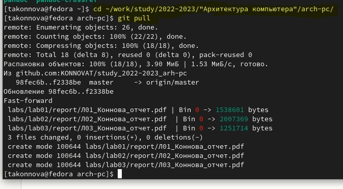
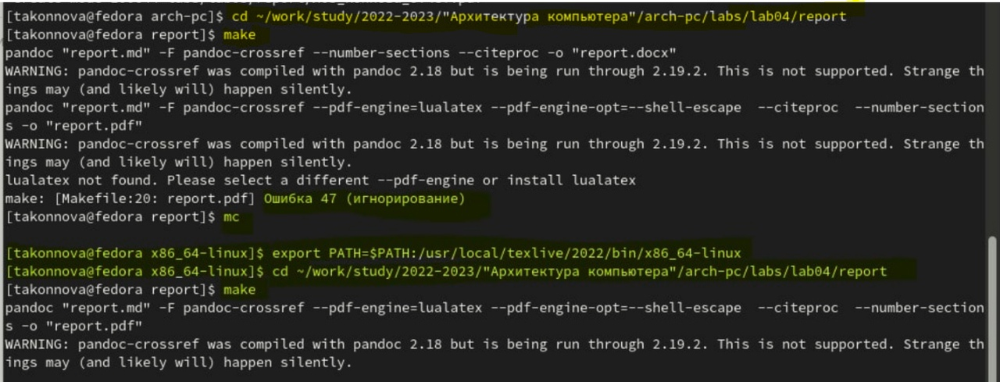
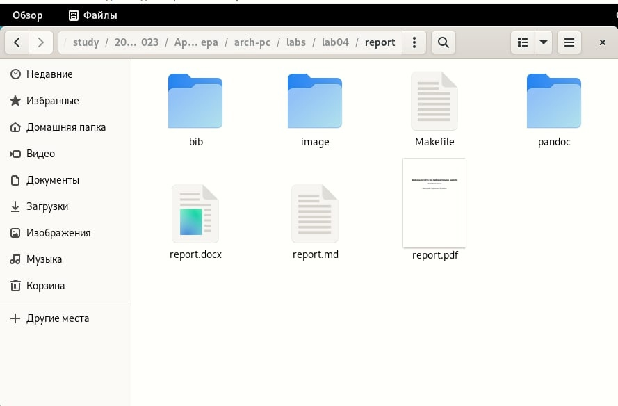
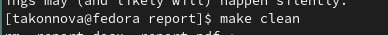
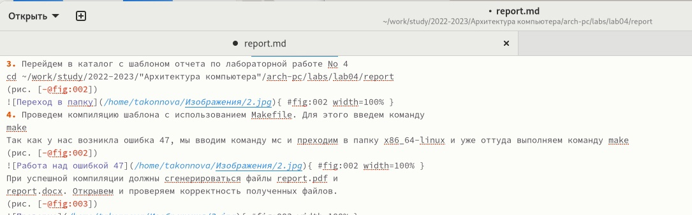
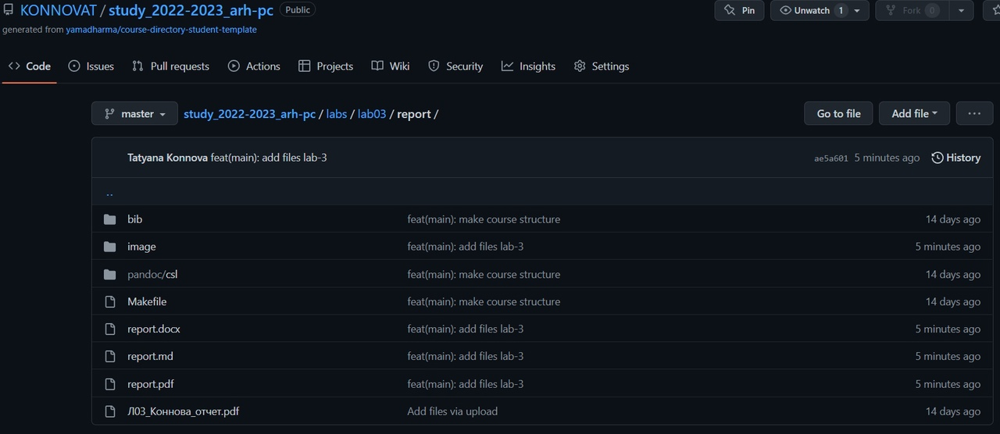
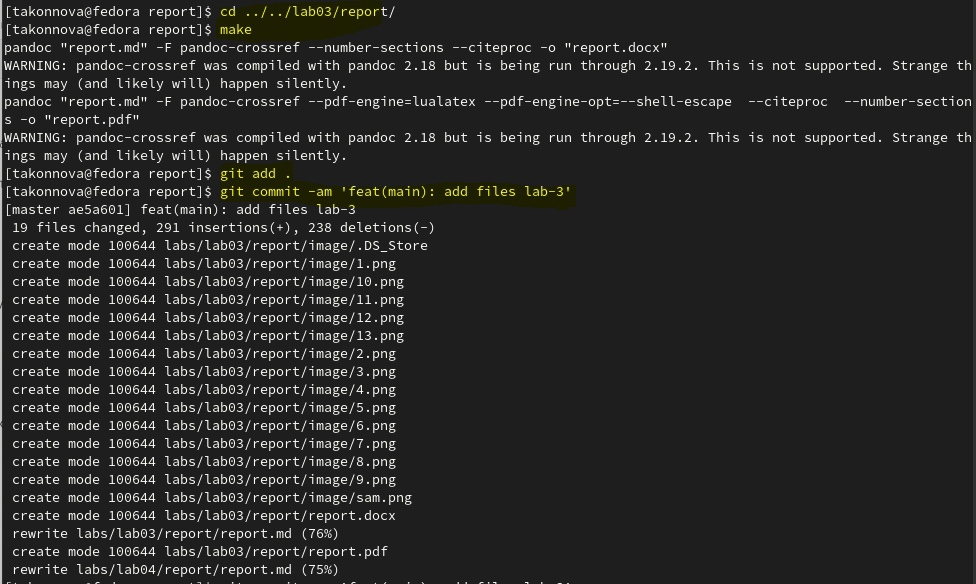
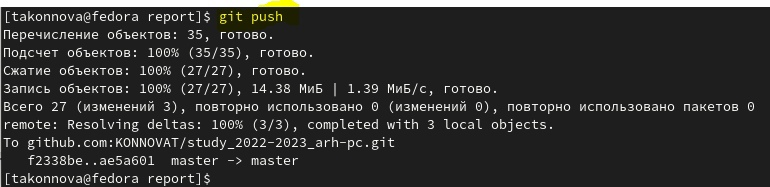

---
## Front matter
title: "Отчёт по лабораторной работе по предмету Архитектура компьютера"
subtitle: "Лабораторная работа №4"
author: "Татьяна Алексеевна Коннова"

## Generic otions
lang: ru-RU
toc-title: "Содержание"

## Pdf output format
toc: true # Table of contents
toc-depth: 2
lof: true # List of figures
fontsize: 12pt
linestretch: 1.5
papersize: a4
documentclass: scrreprt
## I18n polyglossia
polyglossia-lang:
  name: russian
  options:
	- spelling=modern
	- babelshorthands=true
polyglossia-otherlangs:
  name: english
## I18n babel
babel-lang: russian
babel-otherlangs: english
## Fonts
mainfont: PT Serif
romanfont: PT Serif
sansfont: PT Sans
monofont: PT Mono
mainfontoptions: Ligatures=TeX
romanfontoptions: Ligatures=TeX
sansfontoptions: Ligatures=TeX,Scale=MatchLowercase
monofontoptions: Scale=MatchLowercase,Scale=0.9
## Biblatex
biblatex: true
biblio-style: "gost-numeric"
biblatexoptions:
  - parentracker=true
  - backend=biber
  - hyperref=auto
  - language=auto
  - autolang=other*
  - citestyle=gost-numeric
## Pandoc-crossref LaTeX customization
figureTitle: "Рис."
tableTitle: "Таблица"
listingTitle: "Листинг"
lofTitle: "Список иллюстраций"
lolTitle: "Листинги"
## Misc options
indent: true
header-includes:
  - \usepackage{indentfirst}
  - \usepackage{float} # keep figures where there are in the text
  - \floatplacement{figure}{H} # keep figures where there are in the text
---

# Цель работы

Целью работы является освоение процедуры оформления отчетов с помощью
легковесного языка разметки Markdown.

# Выполнение лабораторной работы  

1. Открываем терминал
2. Перейдем в каталог курса, сформированный при выполнении лаборатор-
ной работы No3:
cd ~/work/study/2022-2023/"Архитектура компьютера"/arch-pc/     (рис. [-@fig:001])
Обновляем локальный репозиторий, скачав изменения из удаленного репозитория с помощью команды
git pull  (рис. [-@fig:001])

{ #fig:001 width=100% }

3. Перейдем в каталог с шаблоном отчета по лабораторной работе No 4
cd ~/work/study/2022-2023/"Архитектура компьютера"/arch-pc/labs/lab04/report (рис. [-@fig:002])

{ #fig:002 width=100% }

4. Проведем компиляцию шаблона с использованием Makefile. Для этого введем команду
make
Так как у нас возникла ошибка 47, мы вводим команду мс и преходим в папку x86_64-linux и уже оттуда выполняем команду make (рис. [-@fig:021])

{ #fig:021 width=100% }

При успешной компиляции должны сгенерироваться файлы report.pdf и
report.docx. Открывем и проверяем корректность полученных файлов (рис. [-@fig:003]).

{ #fig:003 width=100% }

5. Удаляем полученный файлы с использованием Makefile. Для этого введем
команду
make clean
Проверяем, что после этой команды файлы report.pdf и report.docx были
удалены.(рис. [-@fig:004])

{ #fig:004 width=100% }

6. Открываем файл report.md c помощью любого текстового редактора, например gedit, но я сделала это вручную. Внимательно изучаем структуру этого файла. В данный момент я работаю над ним. (рис. [-@fig:005])

{ #fig:005 width=100% }

7. Заполняем отчет и скомпилируем отчет с использованием Makefile. Проверяем корректность полученных файлов. (Обращаем внимание, для корректного отображения скриншотов они должны быть размещены в каталоге image).

8. Загружаем файлы на Github. Скриншотов сделать не удасться, потому что мне придется загрузить 4 Лабораторную работу после сохранения этого файла.

## Самостоятельная работа 
1. В соответствующем каталоге сделаем отчёт по лабораторной работе No 3
в формате Markdown. В качестве отчёта предоставляем отчёты
в 3 форматах: pdf, docx и md. (рис. [-@fig:010])  

{ #fig:010 width=100% }

2. Загружаем файлы на github. (рис. [-@fig:011])  

{ #fig:011 width=100% }

git add .  
git commit -am 'feat(main): add files lab-4'   (рис. [-@fig:007])  

{ #fig:007 width=100% }  

git push   (рис. [-@fig:008])  

{ #fig:008 width=100% }

# Выводы

В результате мы освоили процедуру оформления отчетов с помощью
легковесного языка разметки Markdown.

