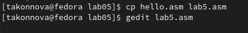

---
## Front matter
title: "Шаблон отчёта по лабораторной работе №5"
subtitle: "Создание и
процесс обработки программ на языке
ассемблера NASM"
author: "Татьяна Алексеевна Коннова"

## Generic otions
lang: ru-RU
toc-title: "Содержание"

## Bibliography
bibliography: bib/cite.bib
csl: pandoc/csl/gost-r-7-0-5-2008-numeric.csl

## Pdf output format
toc: true # Table of contents
toc-depth: 2
lof: true # List of figures
fontsize: 12pt
linestretch: 1.5
papersize: a4
documentclass: scrreprt
## I18n polyglossia
polyglossia-lang:
  name: russian
  options:
	- spelling=modern
	- babelshorthands=true
polyglossia-otherlangs:
  name: english
## I18n babel
babel-lang: russian
babel-otherlangs: english
## Fonts
mainfont: PT Serif
romanfont: PT Serif
sansfont: PT Sans
monofont: PT Mono
mainfontoptions: Ligatures=TeX
romanfontoptions: Ligatures=TeX
sansfontoptions: Ligatures=TeX,Scale=MatchLowercase
monofontoptions: Scale=MatchLowercase,Scale=0.9
## Biblatex
biblatex: true
biblio-style: "gost-numeric"
biblatexoptions:
  - parentracker=true
  - backend=biber
  - hyperref=auto
  - language=auto
  - autolang=other*
  - citestyle=gost-numeric
## Pandoc-crossref LaTeX customization
figureTitle: "Рис."
listingTitle: "Листинг"
lofTitle: "Список иллюстраций"
lolTitle: "Листинги"
## Misc options
indent: true
header-includes:
  - \usepackage{indentfirst}
  - \usepackage{float} # keep figures where there are in the text
  - \floatplacement{figure}{H} # keep figures where there are in the text
---

# Цель работы

Освоение процедуры компиляции и сборки программ, написанных на ассем-
блере NASM.

# Задание

Вывести "Hello world!" и выполнить прочие действия в терминале виртуальной машины, используя ассемблер NASM.

# Выполнение лабораторной работы : Программа Hello world!
Рассмотрим пример простой программы на языке ассемблера NASM. Традиционно первая программа выводит приветственное сообщение Hello world!
на экран.
Создаём каталог для работы с программами на языке ассемблера NASM:  

mkdir ~/.../lab05  (рис. [-@fig:001])

{ #fig:001 width=100% }

Перейдём в созданный каталог  

cd ~/work/arch-pc/lab05  (рис. [-@fig:002])

{ #fig:002 width=100% }

Создаём текстовый файл с именем hello.asm  

touch hello.asm  (рис. [-@fig:003])

откроем этот файл с помощью любого текстового редактора, например, gedit  

gedit hello.asm  (рис. [-@fig:003])

{ #fig:003 width=100% }

и введём в него следующий текст(скриншот взят из файла шаблона данного текста, расположенного на платформе ТУИС). Скопируем и вставим его в настоящий файл:  (рис. [-@fig:004])

{ #fig:004 width=100% }  

В отличие от многих современных высокоуровневых языков программирования, в ассемблерной программе каждая команда располагается на отдельной
строке. Размещение нескольких команд на одной строке недопустимо. Синтаксис ассемблера NASM является чувствительным к регистру, т.е. есть разница
между большими и малыми буквами.

# Транслятор NASM
NASM превращает текст программы в объектный код. Например, для компиляции приведённого выше текста программы «Hello World» необходимо написать:  

nasm -f elf hello.asm  (рис. [-@fig:005])  

{ #fig:005 width=100% }

Если текст программы набран без ошибок, то транслятор преобразует текст
программы из файла hello.asm в объектный код, который запишется в файл
hello.o.

# Расширенный синтаксис командной строки NASM
Выполняем следующую команду:  

nasm -o obj.o -f elf -g -l list.lst hello.asm   (рис. [-@fig:006])

{ #fig:006 width=100% }

Компилирует исходный файл hello.asm в obj.o 
С помощью команды ls проверяем, что файлы были созданы.  (рис. [-@fig:007])

{ #fig:007 width=100% }

# Компоновщик LD
Чтобы получить исполняемую программу,
объектный файл необходимо передать на обработку компоновщику:  

ld -m elf_i386 hello.o -o hello    (рис. [-@fig:008])

{ #fig:008 width=100% }

С помощью команды ls проверяем, что исполняемый файл hello был создан.(рис. [-@fig:009])  

{ #fig:009 width=100% }

Выполняем следующую команду:  

ld -m elf_i386 obj.o -o main  (рис. [-@fig:010]) 

{ #fig:010 width=100% }

# Запуск исполняемого файла
Запустим на выполнение созданный исполняемый файл, находящийся в
текущем каталоге:  

./hello              (рис. [-@fig:011]) 

{ #fig:011 width=100% }

# Задание для самостоятельной работы   

1. В каталоге ~/work/.../lab05 с помощью команды cp создаем копию
файла hello.asm с именем lab5.asm (рис. [-@fig:012]) 

{ #fig:012 width=100% }

2. С помощью любого текстового редактора внесём изменения в текст про-
граммы в файле lab5.asm так, чтобы вместо Hello world! на экран выводилась строка с моей фамилией и моим именем.   (рис. [-@fig:013]) (рис. [-@fig:012]) 

{ #fig:013 width=100% }

3. Оттранслируем полученный текст программы lab5.asm в объектный
файл. Выполним компоновку объектного файла и запустим получившийся исполняемый файл.(рис. [-@fig:014])

{ #fig:014 width=100% }

4. Скопируем файлы hello.asm и lab5.asm в свой локальный репозиторий
в каталог ~/work/study/2022-2023/"Архитектура компьютера"/arch-
pc/labs/lab05/. Загрузим файлы на Githuв(рис. [-@fig:015])

{ #fig:015 width=100% }

# Выводы

Мы наглядно освоили процедуры компиляции и сборки программ, написанных на ассем-
блере NASM.

::: {#refs}
:::
