---
## Front matter
title: "Лабораторная работа №6"
subtitle: "Основы работы с
Midnight Commander (mc). Структура
программы на языке ассемблера NASM.
Системные вызовы в ОС GNU Linux"
author: "Татьяна Алексеевна Коннова, НПИбд-01-22"

## Generic otions
lang: ru-RU
toc-title: "Содержание"

## Bibliography
bibliography: bib/cite.bib
csl: pandoc/csl/gost-r-7-0-5-2008-numeric.csl

## Pdf output format
toc: true # Table of contents
toc-depth: 2
lof: true # List of figures
fontsize: 12pt
linestretch: 1.5
papersize: a4
documentclass: scrreprt
## I18n polyglossia
polyglossia-lang:
  name: russian
  options:
	- spelling=modern
	- babelshorthands=true
polyglossia-otherlangs:
  name: english
## I18n babel
babel-lang: russian
babel-otherlangs: english
## Fonts
mainfont: PT Serif
romanfont: PT Serif
sansfont: PT Sans
monofont: PT Mono
mainfontoptions: Ligatures=TeX
romanfontoptions: Ligatures=TeX
sansfontoptions: Ligatures=TeX,Scale=MatchLowercase
monofontoptions: Scale=MatchLowercase,Scale=0.9
## Biblatex
biblatex: true
biblio-style: "gost-numeric"
biblatexoptions:
  - parentracker=true
  - backend=biber
  - hyperref=auto
  - language=auto
  - autolang=other*
  - citestyle=gost-numeric
## Pandoc-crossref LaTeX customization
figureTitle: "Рис."
listingTitle: "Листинг"
lofTitle: "Список иллюстраций"
lolTitle: "Листинги"
## Misc options
indent: true
header-includes:
  - \usepackage{indentfirst}
  - \usepackage{float} # keep figures where there are in the text
  - \floatplacement{figure}{H} # keep figures where there are in the text
---

# Цель работы

Приобретение практических навыков работы в Midnight Commander. Освоение
инструкций языка ассемблера mov и int.

# Задание
Освоение
инструкций языка ассемблера mov и int.

## Выполнение лабораторной работы : Программа Hello world!
Перейдем в Midnight Commander.

 (рис. [-@fig:001])

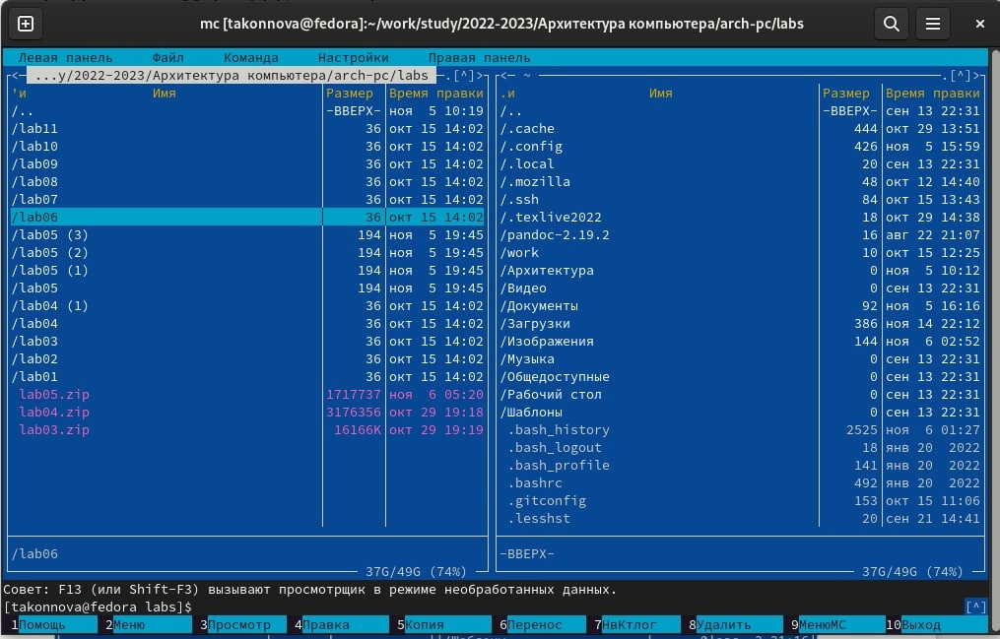{ #fig:001 width=100% }

 Создадим с помощью команды touch  файл lab6-2.asm
  (рис. [-@fig:002])

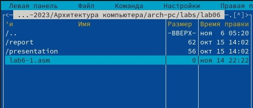{ #fig:002 width=100% }

Оттранслируем текст программы lab6-1.asm в объектный файл. Выполним компоновку объектного файла и запустиим получившийся исполняемый
файл. Программа выводит строку 'Введите строку:' и ожидает ввода с
клавиатуры. На запрос введем наше имя. 
(рис. [-@fig:004])

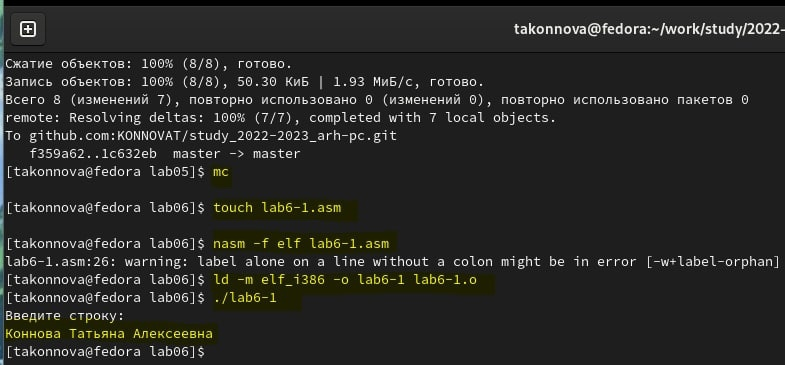{ #fig:004 width=100% }  

Скачаем файл in_out.asm со страницы курса в ТУИС.
Подключаемый файл in_out.asm должен лежать в том же каталоге, что и
файл с программой, в которой он используется.
В одной из панелей mc откроем каталог с файлом lab6-1.asm. В другой панели
каталог со скаченным файлом in_out.asm (для перемещения между панелями
используем Tab ). Скопируем файл in_out.asm в каталог с файлом lab6-1.asm
с помощью функциональной клавиши 

 (рис. [-@fig:005])  

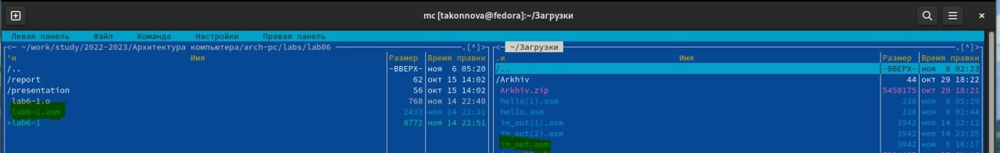{ #fig:005 width=100% }

С помощью функциональной клавиши F6 создаем копию файла lab6-
1.asm с именем lab6-2.asm. Выделяем файл lab6-1.asm, нажимаем клавишу
F6 , введем имя файла lab6-2.asm и нажмем клавишу Enter

   (рис. [-@fig:006])

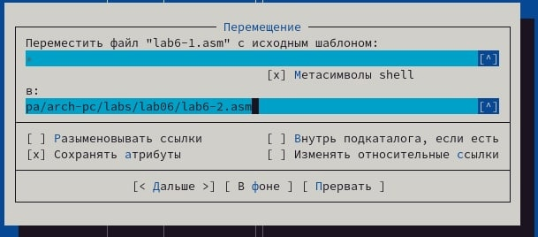{ #fig:006 width=100% }

Исправим текст программы в файле lab6-2.asm с использование под-
программ из внешнего файла in_out.asm (используем подпрограммы
sprintLF, sread и quit) в соответствии с листингом 6.2. Создаем испол-
няемый файл и проверяем его работу
(рис. [-@fig:007])

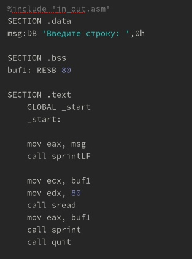{ #fig:007 width=100% }

Проеверяем результат работы программы lab6-2.asm
  (рис. [-@fig:008])

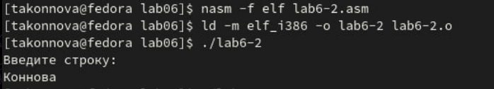{ #fig:008 width=100% }

При включении LF в Sprint вводимые данные отображаются для ввода на следующей строчке. 
## Задание для самостоятельной работы

1. Создаем копию файла lab6-1.asm. Внесем изменения в программу (без
использования внешнего файла in_out.asm), так чтобы она работала по
следующему алгоритму:

вывести приглашение типа “Введите строку:”;

ввести строку с клавиатуры;

вывести введённую строку на экран.

Пусть копией lab6-1.asm будет являться lab6-3.asm (рис. [-@fig:009])  

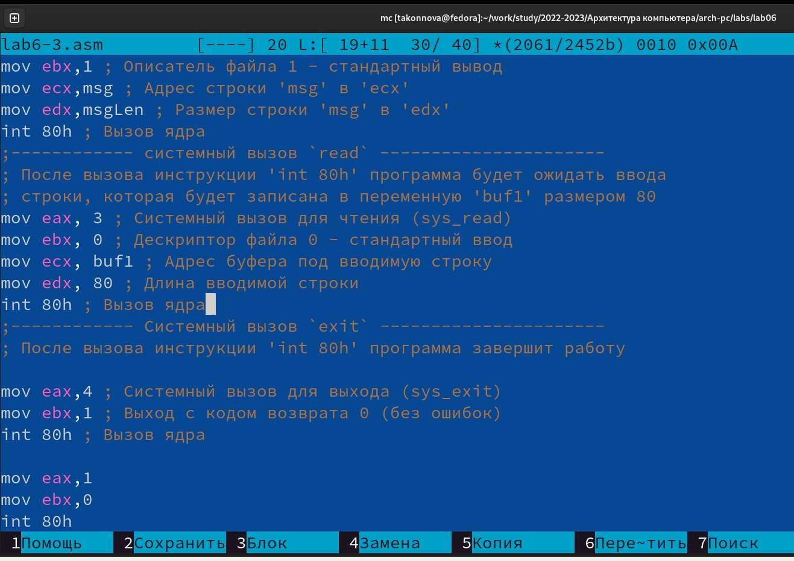{ #fig:009 width=100% }

2. Получаем исполняемый файл и проверяем его работу. На приглашение
ввести строку введем свою фамилию. (рис. [-@fig:010])  

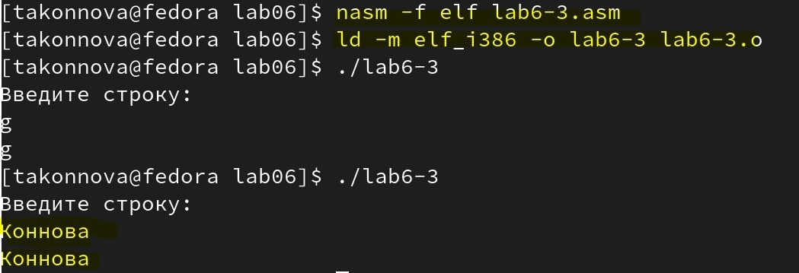{ #fig:010 width=100% }

3. Создаем копию файла lab6-2.asm. Исправляем текст программы с исполь-
зование подпрограмм из внешнего файла in_out.asm, так чтобы она ра-
ботала по следующему алгоритму:

вывести приглашение типа “Введите строку:”;

ввести строку с клавиатуры;

вывести введённую строку на экран.

Подключаемый файл in_out.asm должен лежать в том же
каталоге, что и файл с программой, в которой он используется.
Пусть имя данного файла будет lab6-4.asm (рис. [-@fig:011])  

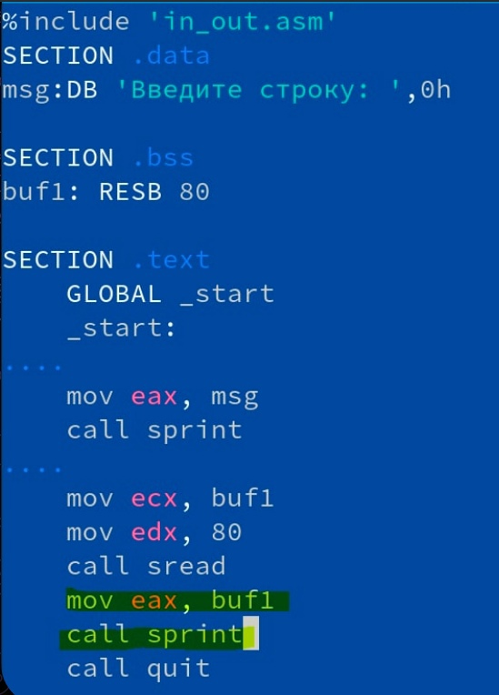{ #fig:011 width=100% }

4. Создаем исполняемый файл и проверяем его работу

 (рис. [-@fig:017]) 

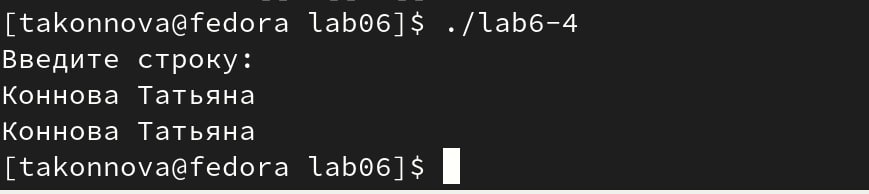{ #fig:017 width=100% }

# Выводы
Я приобрела практические навыки работы в Midnight Commander. Освоила
инструкции языка ассемблера mov и int.

::: {#refs}
:::
