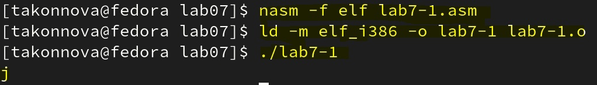

---
## Front matter
title: "Лабораторная работа №7"
subtitle: "Арифметические
операции в NASM."
author: "Татьяна Алексеевна Коннова, НПИбд-01-22"

## Generic otions
lang: ru-RU
toc-title: "Содержание"

## Bibliography
bibliography: bib/cite.bib
csl: pandoc/csl/gost-r-7-0-5-2008-numeric.csl

## Pdf output format
toc: true # Table of contents
toc-depth: 2
lof: true # List of figures
fontsize: 12pt
linestretch: 1.5
papersize: a4
documentclass: scrreprt
## I18n polyglossia
polyglossia-lang:
  name: russian
  options:
	- spelling=modern
	- babelshorthands=true
polyglossia-otherlangs:
  name: english
## I18n babel
babel-lang: russian
babel-otherlangs: english
## Fonts
mainfont: PT Serif
romanfont: PT Serif
sansfont: PT Sans
monofont: PT Mono
mainfontoptions: Ligatures=TeX
romanfontoptions: Ligatures=TeX
sansfontoptions: Ligatures=TeX,Scale=MatchLowercase
monofontoptions: Scale=MatchLowercase,Scale=0.9
## Biblatex
biblatex: true
biblio-style: "gost-numeric"
biblatexoptions:
  - parentracker=true
  - backend=biber
  - hyperref=auto
  - language=auto
  - autolang=other*
  - citestyle=gost-numeric
## Pandoc-crossref LaTeX customization
figureTitle: "Рис."
listingTitle: "Листинг"
lofTitle: "Список иллюстраций"
lolTitle: "Листинги"
## Misc options
indent: true
header-includes:
  - \usepackage{indentfirst}
  - \usepackage{float} # keep figures where there are in the text
  - \floatplacement{figure}{H} # keep figures where there are in the text
---

# Цель работы

Освоение арифметических инструкций языка ассемблера NASM.
## Задание
Выполнить операции с помощью ассемблера

## Выполнение лабораторной работы 

1. Создаем каталог для программам лабораторной работы No 7, перейдем в
него и создаем файл lab7-1.asm:
mkdir ~/work/arch-pc/lab07
cd ~/work/arch-pc/lab07
touch lab7-1.asm

(рис. [-@fig:001])

{ #fig:001 width=100% }

2. Рассмотрим примеры программ вывода символьных и численных значе-
ний. Программы будут выводить значения записанные в регистр eax.
Введите в файл lab7-1.asm текст программы из листинга 7.1. В данной про-
грамме в регистр eax записывается символ 6 (mov eax,'6'), в регистр ebx
символ 4 (mov ebx,'4'). Далее к значению в регистре eax прибавляем зна-
чение регистра ebx (add eax,ebx, результат сложения запишется в регистр
eax). Далее выводим результат. Так как для работы функции sprintLF в регистр
eax должен быть записан адрес, необходимо использовать дополнительную
переменную. Для этого запишем значение регистра eax в переменную buf1
(mov [buf1],eax), а затем запишем адрес переменной buf1 в регистр eax (mov
eax,buf1) и вызовем функцию sprintLF

(рис. [-@fig:002])

{ #fig:002 width=100% }

В данном случае при выводе значения регистра eax мы ожидаем увидеть
число 10. Однако результатом будет символ j. Это происходит потому, что код
символа 6 равен 00110110 в двоичном представлении (или 54 в десятичном
представлении), а код символа 4 – 00110100 (52). Команда add eax,ebx запишет
в регистр eax сумму кодов – 01101010 (106), что в свою очередь является кодом
символа j 
 
 (рис. [-@fig:003])

{ #fig:003 width=100% }

3. Далее изменим текст программы и вместо символов, запишем в реги-
стры числа. Исправим текст программы (Листинг 1) следующим образом:

mov eax,'6'
mov ebx,'4'
на строки
mov eax,6
mov ebx,4

Как и в предыдущем случае при исполнении программы мы не получим число

(рис. [-@fig:004])

{ #fig:004 width=100% }

(рис. [-@fig:005])

{ #fig:005 width=100% }

10. В данном случае выводится символ с кодом 10. Пользуясь таблицей ASCII
определим какому символу соответствует код 10. 

line feed, LF — «подача бумаги на строку») — управляющий символ ASCII ( 0x0A , 10 в десятичной системе счисления, при выводе которого курсор перемещается на следующую строку.

(рис. [-@fig:006])

{ #fig:006 width=100% }

(рис. [-@fig:007])

{ #fig:007 width=100% }

4. Как отмечалось выше, для работы с числами в файле in_out.asm реализова-
ны подпрограммы для преобразования ASCII символов в числа и обратно.
Преобразуем текст программы из Листинга 7.1 с использованием этих
функций.
Создаем файл lab7-2.asm в каталоге ~/work/arch-pc/lab07 и введим в него
текст программы из листинга 7.2.
touch ~/work/arch-pc/lab07/lab7-2.asm

Создаем исполняемый файл и запускаем его
В результате работы программы мы получим число 106. В данном случае, как
и в первом, команда add складывает коды символов ‘6’ и ‘4’ (54+52=106). Однако,
в отличии от программы из листинга 7.1, функция iprintLF позволяет вывести
число, а не символ, кодом которого является это число.

(рис. [-@fig:012])

{ #fig:012 width=100% }

(рис. [-@fig:013])

{ #fig:013 width=100% }

5. Аналогично предыдущему примеру изменим символы на числа. Заменим
строки

mov eax,'6'
mov ebx,'4'
на строки
mov eax,6
mov ebx,4

Создаем исполняемый файл и запускаем его. 
Заменяем функцию iprintLF на iprint. Создаем исполняемый файл и запускаем его. 

(рис. [-@fig:014])

{ #fig:014 width=100% }

# 7.3.2. Выполнение арифметических операций в NASM

6. В качестве примера выполнения арифметических операций в NASM при-
ведем программу вычисления арифметического выражения f(x) = (5 * 2 +
3)/3.
Создаем файл lab7-3.asm в каталоге ~/work/arch-pc/lab07:
touch ~/work/arch-pc/lab07/lab7-3.asm
Внимательно изучаем текст программы из листинга 7.3 и вводим в lab7-3.asm.

(рис. [-@fig:015])

{ #fig:015 width=100% }

1. Какие строки листинга 7.4 отвечают за вывод на экран сообщения ‘Ваш
вариант:’?

mov eax, rem

call sprint

2. Для чего используется следующие инструкции? nasm mov ecx, x
mov edx, 80 call sread
Подобное необходимо затем, чтобы мы ввели посыл не более 80 символьных значений в переменную х

3. Для чего используется инструкция “call atoi”?
Чтобы работать не с символами из ASCII работающей по порядковым номерам, а с числами, то есть с реальными цифрами.

4. Какие строки листинга 7.4 отвечают за вычисления варианта?

xor edx,edx

mov ebx,20

div ebx

inc edx

5. В какой регистр записывается остаток от деления при выполнении ин-
струкции “div ebx”?

edx

6. Для чего используется инструкция “inc edx”?
Чтобы провести требуемую операцию по нахождению остатка от 20 и прибавления единицы. В частности, последнего.

7. Какие строки листинга 7.4 отвечают за вывод на экран результата вычислений?

mov eax,edx
call iprintLF

# Самостоятельная работа  
Выполним самостоятельное задание, следуя инструкции. 
Произведем вычисления 19 функции, воспользовавшись ассемблером.

(рис. [-@fig:016])

{ #fig:016 width=100% }

(рис. [-@fig:017])

{ #fig:017 width=100% }

# Выводы
Освоение арифметических инструкций языка ассемблера NASM.

::: {#refs}
:::
