---
## Front matter
title: "Лабораторная работа №8"
subtitle: "Команды
безусловного и условного переходов в
Nasm. Программирование ветвлений."
author: "Татьяна Алексеевна Коннова, НПИбд-01-22"

## Generic otions
lang: ru-RU
toc-title: "Содержание"

## Bibliography
bibliography: bib/cite.bib
csl: pandoc/csl/gost-r-7-0-5-2008-numeric.csl

## Pdf output format
toc: true # Table of contents
toc-depth: 2
lof: true # List of figures
fontsize: 12pt
linestretch: 1.5
papersize: a4
documentclass: scrreprt
## I18n polyglossia
polyglossia-lang:
  name: russian
  options:
	- spelling=modern
	- babelshorthands=true
polyglossia-otherlangs:
  name: english
## I18n babel
babel-lang: russian
babel-otherlangs: english
## Fonts
mainfont: PT Serif
romanfont: PT Serif
sansfont: PT Sans
monofont: PT Mono
mainfontoptions: Ligatures=TeX
romanfontoptions: Ligatures=TeX
sansfontoptions: Ligatures=TeX,Scale=MatchLowercase
monofontoptions: Scale=MatchLowercase,Scale=0.9
## Biblatex
biblatex: true
biblio-style: "gost-numeric"
biblatexoptions:
  - parentracker=true
  - backend=biber
  - hyperref=auto
  - language=auto
  - autolang=other*
  - citestyle=gost-numeric
## Pandoc-crossref LaTeX customization
figureTitle: "Рис."
listingTitle: "Листинг"
lofTitle: "Список иллюстраций"
lolTitle: "Листинги"
## Misc options
indent: true
header-includes:
  - \usepackage{indentfirst}
  - \usepackage{float} # keep figures where there are in the text
  - \floatplacement{figure}{H} # keep figures where there are in the text
---

# Цель работы

Изучение команд условного и безусловного переходов. Приобретение навыков написания программ с использованием переходов. Знакомство с назначением и структурой файла листинга

## Задание  

Программирование ветвлений

## Выполнение лабораторной работы 

1. Создаем каталог для программам лабораторной работы N 8, переходим в
него и создайте файл lab8-1.asm:

mkdir ~/work/arch-pc/lab08

cd ~/work/arch-pc/lab08

touch lab8-1.asm

2. Инструкция jmp в NASM используется для реализации безусловных пере-
ходов. Рассмотрим пример программы с использованием инструкции jmp.
Введем в файл lab8-1.asm текст программы из листинга 8.1. (рис. [-@fig:001])

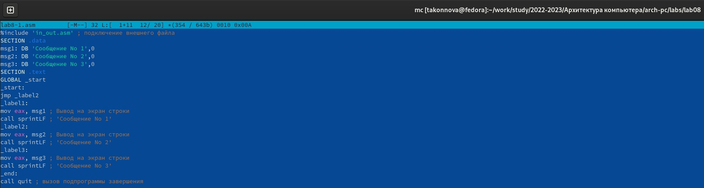{ #fig:001 width=150% }

Создаем исполняемый файл и запускаем его. Результат работы данной программы будет следующим:

 ./lab8-1
 
Сообщение No 2

Сообщение No 3

Таким образом, использование инструкции jmp _label2 меняет порядок ис-
полнения инструкций и позволяет выполнить инструкции начиная с метки
_label2, пропустив вывод первого сообщения.
Инструкция jmp позволяет осуществлять переходы не только вперед но
и назад. Изменим программу таким образом, чтобы она выводила сначала
‘Сообщение No 2’, потом ‘Сообщение No 1’ и завершала работу. Для этого в
текст программы после вывода сообщения No 2 добавим инструкцию jmp с
меткой _label1 (т.е. переход к инструкциям вывода сообщения No 1) и после
вывода сообщения No 1 добавим инструкцию jmp с меткой _end (т.е. переход к
инструкции call quit). Изменим текст программы  (рис. [-@fig:002])   (рис. [-@fig:003])  (рис. [-@fig:004])

{ #fig:002 width=100% }

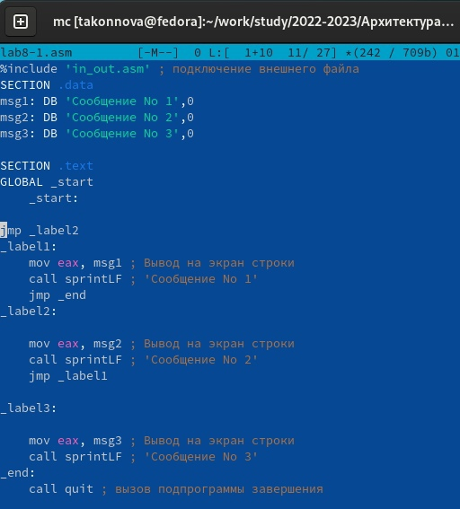{ #fig:003 width=70% }

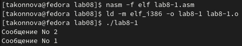{ #fig:004 width=100% }

Создаем исполняемый файл и проверяем его работу.

Изменяем текст программы добавив или изменив инструкции jmp, чтобы
вывод программы был следующим: (рис. [-@fig:005])  (рис. [-@fig:006])
./lab8-1
 
Сообщение No 3

Сообщение No 2

Сообщение No 1

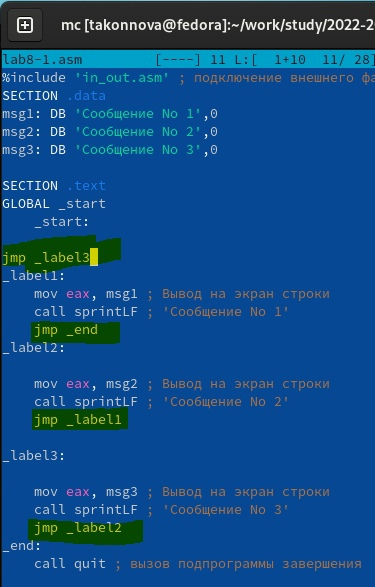{ #fig:005 width=100% }

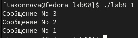{ #fig:006 width=100% }

Использование инструкции jmp приводит к переходу в любом случае. Од-
нако, часто при написании программ необходимо использовать условные
переходы, т.е. переход должен происходить если выполнено какое-либо
условие. В качестве примера рассмотрим программу, которая определяет
и выводит на экран наибольшую из 3 целочисленных переменных: A,B
и C. Значения для A и C задаются в программе, значение B вводиться с
клавиатуры.
Создаем файл lab8-2.asm в каталоге 

~/work/arch-pc/lab08

Внимательно изучаем текст программы из листинга 8.3 и введем в lab8-2.asm. (рис. [-@fig:007]) (рис. [-@fig:008])

Создаем исполняемый файл и проверяем его работу для разных значений B.

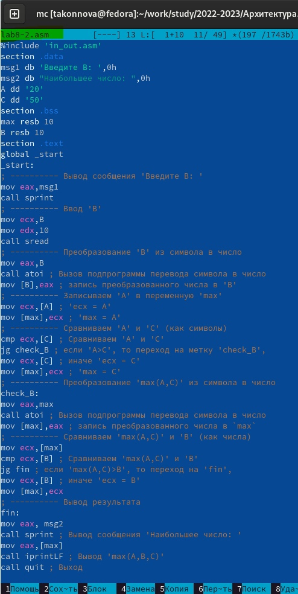{ #fig:007 width=100% }

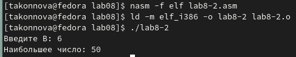{ #fig:008 width=100% }

Обращаем внимание, в данном примере переменные A и С сравниваются как
символы, а переменная B и максимум из A и С как числа (для этого используется
функция atoi преобразования символа в число). Это сделано для демонстрации того, как сравниваются данные. Данную программу можно упростить и
сравнивать все 3 переменные как символы (т.е. не использовать функцию atoi).
Однако если переменные преобразовать из символов числа, над ними можно
корректно проводить арифметические операции.

## Изучение структуры файлы листинга  

 Обычно nasm создаёт в результате ассемблирования только объектный
файл. Получить файл листинга можно, указав ключ -l и задав имя файла
листинга в командной строке. Создаем файл листинга для программы из
файла lab8-2.asm

nasm -f elf -l lab8-2.lst lab8-2.asm

Откроем файл листинга lab8-2.lst с помощью любого текстового редактора,
например mcedit:

mcedit lab8-2.lst

Внимательно ознакомимся с его форматом и содержимым. Подробно объясним содержимое трёх строк файла листинга по выбору.  

  

                      строка 51  

51 - номер строки

00000033 - адрес

B80A000000 - машинный код

mov eax, 0AH - код программы

  

                       строка 37  

37 - номер строки

00000135 - адрес

E862FFFFFF - машинный код

call atoi- код программы

  

                        строка 53  

53 - номер строки

00000039 - адрес

89E0 - машинный код

mov     eax, esp - код программы
  
  

Откроем файл с программой lab8-2.asm и в любой инструкции с двумя
операндами удалить один операнд. Выполним трансляцию с получением файла
листинга:

nasm -f elf -l lab8-2.lst lab8-2.asm

Какие выходные файлы создаются в этом случае? Что добавляется в листинге?

Ответ: после удаления операнда появилась ошибка и файлы не формировались, а в листинге ошибка.(рис. [-@fig:010])

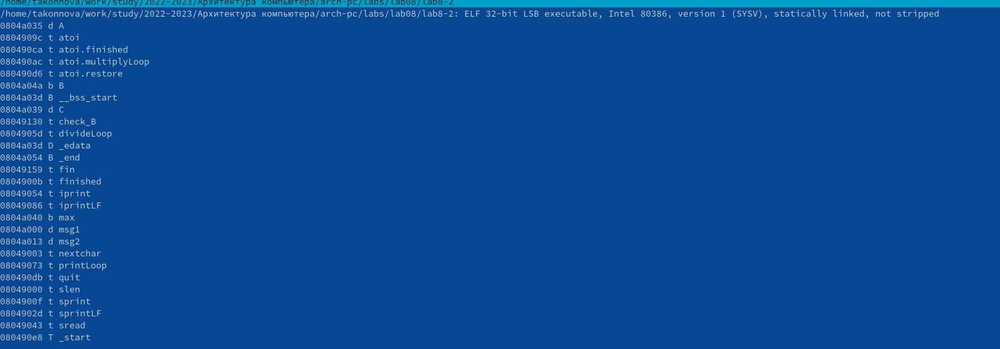{ #fig:010 width=100% }

## Самостоятельная работа  

1. Напишите программу нахождения наименьшей из 3 целочисленных пере-
менных a b  и c . Значения переменных выбрать из табл. 8.5 в соответствии
с вариантом, полученным при выполнении лабораторной работы No 7.
Создайте исполняемый файл и проверьте его работу.

2. Напишите программу, которая для введенных с клавиатуры значений x and a вычисляет значение заданной функции и выводит результат вычислений. Вид функции выбрать из таблицы 8.6 вариантов заданий в
соответствии с вариантом, полученным при выполнении лабораторной
работы No 7. Создайте исполняемый файл и проверьте его работу для значений  x and a

Мой вариант = 15.
Напишем программу нахождения наибольшего из переменных a, b, с то есть  32, 6 и 54.

Создадим исполняемый файл и проверим его работу.  (рис. [-@fig:011])   (рис. [-@fig:012]) 

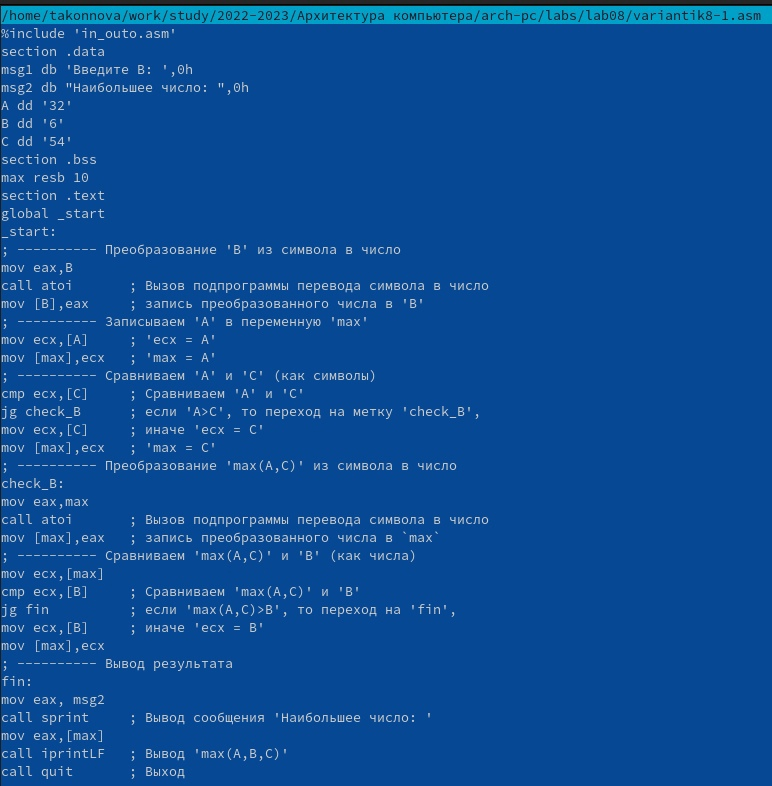{ #fig:011 width=100% }

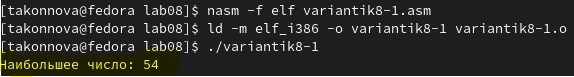{ #fig:012 width=100% }

Напишем вторую программу для введенных с клавиатуры значений x и a она вычисляет значение заданной функции 15 и выводит результат вычислений.
Создадим исполняемый файл и проверим его работу для значений  2, 3 для первого примера и 4, 2 - для вт. примера (рис. [-@fig:013]) (рис. [-@fig:014])

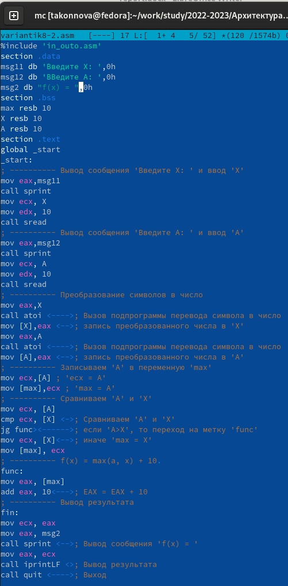{ #fig:013 width=100% }

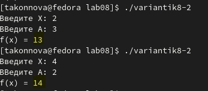{ #fig:014 width=100% }

# Выводы
Мы научились командам условного и безусловного переходов, приобрели навыков написания программ с использованием переходов, познакомились с назначением и структурой файла листинга.

::: {#refs}
:::
