---
## Front matter
title: "Лабораторная работа №9"
subtitle: "Программирование цикла. Обработка
аргументов командной строки."
author: "Татьяна Алексеевна Коннова, НПИбд-01-22"

## Generic otions
lang: ru-RU
toc-title: "Содержание"

## Bibliography
bibliography: bib/cite.bib
csl: pandoc/csl/gost-r-7-0-5-2008-numeric.csl

## Pdf output format
toc: true # Table of contents
toc-depth: 2
lof: true # List of figures
fontsize: 12pt
linestretch: 1.5
papersize: a4
documentclass: scrreprt
## I18n polyglossia
polyglossia-lang:
  name: russian
  options:
	- spelling=modern
	- babelshorthands=true
polyglossia-otherlangs:
  name: english
## I18n babel
babel-lang: russian
babel-otherlangs: english
## Fonts
mainfont: PT Serif
romanfont: PT Serif
sansfont: PT Sans
monofont: PT Mono
mainfontoptions: Ligatures=TeX
romanfontoptions: Ligatures=TeX
sansfontoptions: Ligatures=TeX,Scale=MatchLowercase
monofontoptions: Scale=MatchLowercase,Scale=0.9
## Biblatex
biblatex: true
biblio-style: "gost-numeric"
biblatexoptions:
  - parentracker=true
  - backend=biber
  - hyperref=auto
  - language=auto
  - autolang=other*
  - citestyle=gost-numeric
## Pandoc-crossref LaTeX customization
figureTitle: "Рис."
listingTitle: "Листинг"
lofTitle: "Список иллюстраций"
lolTitle: "Листинги"
## Misc options
indent: true
header-includes:
  - \usepackage{indentfirst}
  - \usepackage{float} # keep figures where there are in the text
  - \floatplacement{figure}{H} # keep figures where there are in the text
---

# Цель работы

Приобретение навыков написания программ с использованием циклов и
обработкой аргументов командной строки.

## Задание  

Программирование ветвлений

## Выполнение лабораторной работы 

### Реализация циклов в NASM  

Создаем файл lab9-1.asm
touch lab9-1.asm
При реализации циклов в NASM с использованием инструкции loop необходимо помнить о том, что эта инструкция использует регистр ecx в качестве счетчика и на каждом шаге уменьшает его значение на единицу. В качестве примера рассмотрим программу (Листинг 9.1). Введем в файл lab9-1.asm текст программы из листинга 9.1. Создадим исполняемый файл и проверим его работу.
Данный пример показывает, что использование регистра ecx в теле цикла loop может привести к некорректной работе программы. (рис. [-@fig:001])  
(рис. [-@fig:002])

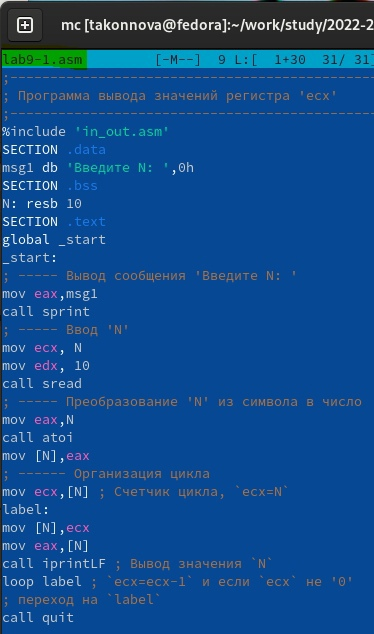{ #fig:001 width=70% }

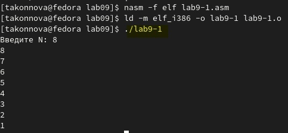{ #fig:002 width=70% }

Изменим текст программы, добавив изменение значение регистра ecx в цикле:
label:...

(рис. [-@fig:003]) 

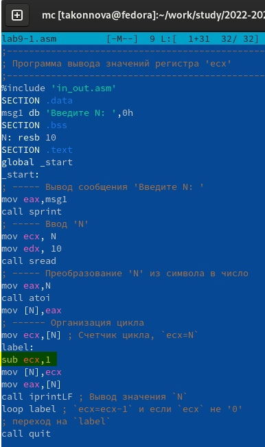{ #fig:003 width=70% }

Создаем исполняемый файл и проверяем его работу. 

(рис. [-@fig:204]) 

(рис. [-@fig:005])

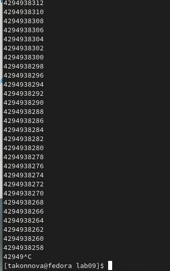{ #fig:204 width=70% }

При четных:(создала еще один новый файл lab9_1.asm, так как забыла про отделение четных чисел и нечетных)

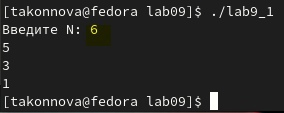{ #fig:005 width=70% }

 Соответствует ли число проходов цикла значению N
введенному с клавиатуры?

* Ответ: бесконечный цикл выводится при нечетных N и нечетные числа выводятся при четных значениях N

Для использования регистра ecx в цикле и сохранения корректности работы
программы можно использовать стек. Внесем изменения в текст программы
добавив команды push и pop (добавления в стек и извлечения из стека) для
сохранения значения счетчика цикла loop:

Создаем исполняемый файл и проверяем его работу. (рис. [-@fig:006])  (рис. [-@fig:007])  Соответствует ли в данном случае число проходов цикла значению N введенному с клавиатуры?

* Ответ: программа обрабатывает, выводит числа от N-1 до 0, поэтому число проходов цикла есть само число N раз.

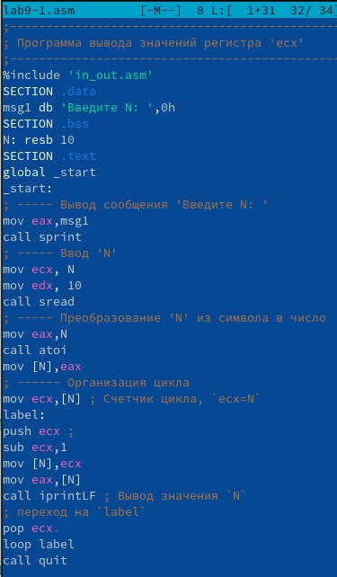{ #fig:006 width=70% }   

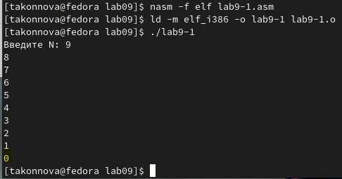{ #fig:007 width=70% }

## 9.3.2. Обработка аргументов командной строки

При разработке программ иногда встает необходимость указывать аргументы,
которые будут использоваться в программе, непосредственно из командной
строки при запуске программы.
При запуске программы в NASM аргументы командной строки загружаются
в стек в обратном порядке, кроме того в стек записывается имя программы и
общее количество аргументов. Последние два элемента стека для программы,
скомпилированной NASM, – это всегда имя программы и количество передан-
ных аргументов.
Таким образом, для того чтобы использовать аргументы в программе, их про-
сто нужно извлечь из стека. Обработку аргументов нужно проводить в цикле.
Т.е. сначала нужно извлечь из стека количество аргументов, а затем циклично
для каждого аргумента выполнить логику программы. В качестве примера рас-
смотрим программу, которая выводит на экран аргументы командной строки.
Внимательно изучим текст программы (Листинг 9.2).

Создаем файл lab9-2.asm в каталоге ~/work/arch-pc/lab09 и введите в него
текст программы из листинга 9.2.
Создаем исполняемый файл и запускаем его, указав аргументы (рис. [-@fig:008]) (рис. [-@fig:009])

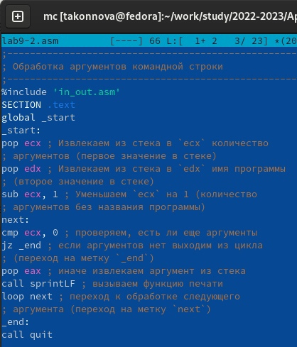{ #fig:008 width=70% }    

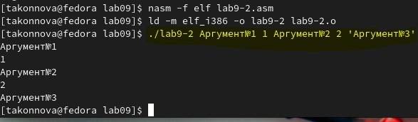{ #fig:009 width=70% }    

Сколько аргументов было обработано программой?  
* Ответ: 5

Рассмотрим еще один пример программы которая выводит сумму чисел,
которые передаются в программу как аргументы. Создайте файл lab9-3.asm, введите в него текст программы из листинга
9.3.
Создайте исполняемый файл и запустите его, указав аргументы.  (рис. [-@fig:010]) (рис. [-@fig:011])

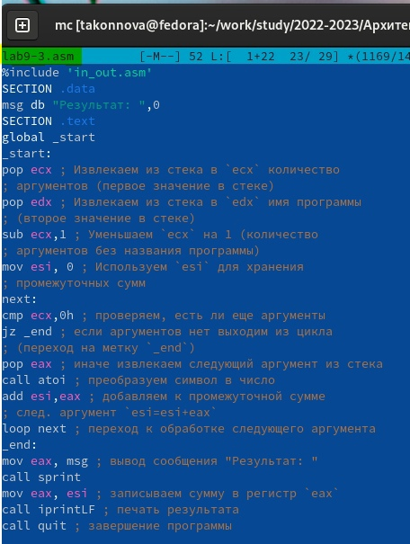{ #fig:010 width=70% }   

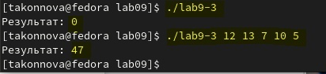{ #fig:011 width=70% }   

Изменим текст программы из листинга 9.3 для вычисления произведения
аргументов командной строки.

 (рис. [-@fig:012]) (рис. [-@fig:013])

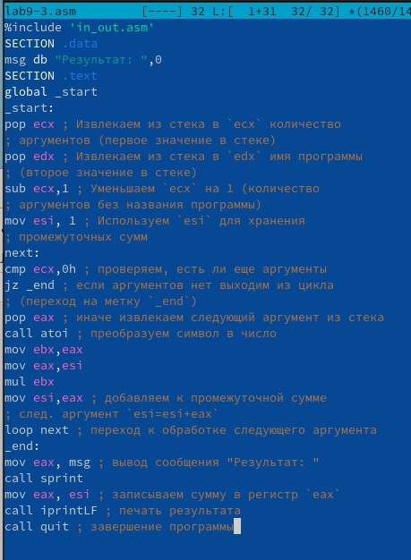{ #fig:012 width=70% }   

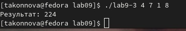{ #fig:013 width=70% }   

## Самостоятельная работа  

Напишите программу, которая находит сумму значений функции F(X)
для x = x1, x2, ..., xn, т.е. программа должна выводить значение f(x1) +
f(x2)+...+f(xn). Значения xi передаются как аргументы. Вид функции f(x)
выбрать из таблицы 9.1 вариантов заданий в соответствии с вариантом, по-
лученным при выполнении лабораторной работы No 7. Создайте исполня-
емый файл и проверьте его работу на нескольких наборах x = x1, x2, ..., xn. 

Вариант моей самостоятельной работы = №15, а именно f(x) = 6x + 13

(рис. [-@fig:014]) (рис. [-@fig:015])

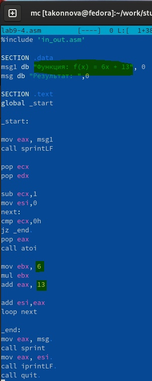{ #fig:014 width=70% }   

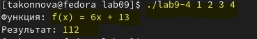{ #fig:015 width=80% }   

# Выводы
Мы приобрели навыки написания программ с использованием циклов и
обработкой аргументов командной строки.

