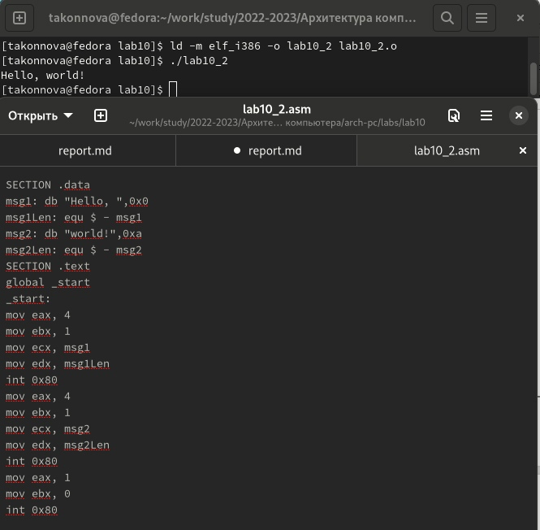

---
## Front matter
title: "Лабораторная работа №10"
subtitle: "Понятие
подпрограммы. Отладчик GDB"
author: "Татьяна Алексеевна Коннова, НПИбд-01-22"

## Generic otions
lang: ru-RU
toc-title: "Содержание"

## Bibliography
bibliography: bib/cite.bib
csl: pandoc/csl/gost-r-7-0-5-2008-numeric.csl

## Pdf output format
toc: true # Table of contents
toc-depth: 2
lof: true # List of figures
fontsize: 12pt
linestretch: 1.5
papersize: a4
documentclass: scrreprt
## I18n polyglossia
polyglossia-lang:
  name: russian
  options:
	- spelling=modern
	- babelshorthands=true
polyglossia-otherlangs:
  name: english
## I18n babel
babel-lang: russian
babel-otherlangs: english
## Fonts
mainfont: PT Serif
romanfont: PT Serif
sansfont: PT Sans
monofont: PT Mono
mainfontoptions: Ligatures=TeX
romanfontoptions: Ligatures=TeX
sansfontoptions: Ligatures=TeX,Scale=MatchLowercase
monofontoptions: Scale=MatchLowercase,Scale=0.9
## Biblatex
biblatex: true
biblio-style: "gost-numeric"
biblatexoptions:
  - parentracker=true
  - backend=biber
  - hyperref=auto
  - language=auto
  - autolang=other*
  - citestyle=gost-numeric
## Pandoc-crossref LaTeX customization
figureTitle: "Рис."
listingTitle: "Листинг"
lofTitle: "Список иллюстраций"
lolTitle: "Листинги"
## Misc options
indent: true
header-includes:
  - \usepackage{indentfirst}
  - \usepackage{float} # keep figures where there are in the text
  - \floatplacement{figure}{H} # keep figures where there are in the text
---

# Цель работы
Приобретение навыков написания программ с использованием подпрограмм.
Знакомство с методами отладки при помощи GDB и его основными возможно-
стями  

## Задание  

Знакомство с подпрограммами

## Выполнение лабораторной работы 

### Реализация подпрограмм в NASM

1. Создаем каталог для выполнения лабораторной работы No 10, переходим
в него и создаем файл lab10-1.asm:

mkdir ~/work/arch-pc/lab10  

cd ~/work/arch-pc/lab10  

touch lab10-1.asm

2. В качестве примера рассмотрим программу вычисления арифметического
выражения f(x)= 2x+7 с помощью подпрограммы _calcul. В данном
примере x вводится с клавиатуры, а само выражение вычисляется в подпрограмме. Внимательно изучаем текст программы:(рис. [-@fig:001])  

{ #fig:001 width=70% }  

Первые строки программы отвечают за вывод сообщения на экран (call
sprint), чтение данных введенных с клавиатуры (call sread) и преобразова-
ния введенных данных из символьного вида в численный (call atoi).

После следующей инструкции call _calcul, которая передает управление
подпрограмме _calcul, будут выполнены инструкции подпрограммы:
  
mov ebx,2  

mul ebx  

add eax,7  

mov [rez,eax  

ret  

Инструкция ret является последней в подпрограмме и ее исполнение приводит к возвращению в основную программу к инструкции, следующей за инструкцией call, которая вызвала данную подпрограмму.  

Последние строки программы реализую вывод сообщения (call sprint), результата вычисления (call iprintLF) и завершение программы (call quit).  

Введем в файл lab10-1.asm текст программы из листинга 10.1. Создадим
исполняемый файл и проверим его работу.  

* Изменим текст программы, добавив подпрограмму _subcalcul в подпрограмму _calcul, для вычисления выражения f(g(x)), где x вводится с клавиатуры, f(x) = 2x+7, g(x) = 3x-1. Т.е. x передается в подпрограмму _calcul из нее в подпрограмму _subcalcul, где вычисляется выражение G(X), результат возвращается в _calcul и вычисляется выражение f(g(x)). Результат возвращается в основную программу для вывода результата на экран. (рис. [-@fig:002])

{ #fig:002 width=70% }

## 9.3.2. Oтладка программам с помощью GDB

Создадим файл lab10-2.asm с текстом программы из Листинга 10.2. (Программа печати сообщения Hello world!):  

 (рис. [-@fig:003]) 

{ #fig:003 width=70% }    
   

Получим исполняемый файл. Для работы с GDB в исполняемый файл необходимо добавить отладочную информацию, для этого трансляцию программ
необходимо проводить с ключом ‘-g’.  

nasm -f elf -g -l lab10-2.lst lab10-2.asm  

ld -m elf_i386 -o lab10-2 lab10-2.o  

Загрузите исполняемый файл в отладчик gdb:  
 (рис. [-@fig:004]) 

{ #fig:004 width=110% } 

gdb lab10-2  
 
 
Проверим работу программы, запустив ее в оболочке GDB с помощью команды run (сокращённо r):  

(gdb) run  

Starting program: ~/work/arch-pc/lab10/lab10-2  

Hello, world!    

Выводится Inferior 1 (process 10220) exited normally
 
(gdb)  

Для более подробного анализа программы установим брейкпоинт на метку
_start, с которой начинается выполнение любой ассемблерной программы, и
запускаем её.  

(gdb) break _start  
 (рис. [-@fig:005]) 

{ #fig:005 width=100% } 

Breakpoint 1 at 0x8049000: file lab10-2.asm, line 12.  

(gdb) run  

Starting program: ~/work/arch-pc/lab10/lab10-2  

Breakpoint 1, _start () at lab10-2.asm:12  

12 mov eax, 4  

Посмотрим дисассимилированный код программы с помощью команды
disassemble начиная с метки _start  

(gdb) disassemble _start  

Переключимся на отображение команд с Intel’овским синтаксисом, введя
команду set disassembly-flavor intel  

(gdb) set disassembly-flavor intel  

(gdb) disassemble _start  

Перечислим различия отображения синтаксиса машинных команд в режимах
ATT и Intel.  

Включим режим псевдографики для более удобного анализа программы (рис.
10.2):  

(gdb) layout asm  

(gdb) layout regs  

В этом режиме есть три окна после выполнения команды si, (показано до нее):

• В верхней части видны названия регистров и их текущие значения;

• В средней части виден результат дисассимилирования программы;

• Нижняя часть доступна для ввода команд.

(рис. [-@fig:008]) 

{ #fig:008 width=100% } 

##  10.4.2.1. Добавление точек останова  

Установить точку останова можно командой break (кратко b). Типичный аргумент этой команды — место установки. Его можно задать или как номер строки
программы (имеет смысл, если есть исходный файл, а программа компилировалась с информацией об отладке), или как имя метки, или как адрес. Чтобы не было путаницы с номерами, перед адресом ставится «звёздочка»:
На предыдущих шагах была установлена точка останова по имени метки
(_start). Проверим это с помощью команды info breakpoints (кратко i b)(ввела эту команду, она не сохранилась на экране, к сожалению):

(gdb) info breakpoints  

Установим еще одну точку останова по адресу инструкции. Адрес инструкции можно увидеть в средней части экрана в левом столбце соответствующей
инструкции (см. рис. 10.3). Определим адрес предпоследней инструкции (mov
ebx,0x0) и установим точку останова.  

(gdb) break *<адрес>  

Посмотрим информацию о всех установленных точках останова:  

(gdb) i b  

(рис. [-@fig:007])  (рис. [-@fig:056]) 

{ #fig:007 width=100% } 

{ #fig:056 width=100% } 

##  10.4.2.2. Работа с данными программы в GDB  

Отладчик может показывать содержимое ячеек памяти и регистров, а при
необходимости позволяет вручную изменять значения регистров и переменных.
Выполним 5 инструкций с помощью команды stepi (или si) и проследим за
изменением значений регистров. Значения каких регистров изменяются?    

  Ответ: меняются одномерно значения регистров, а именно eax, ecx, edx, ebx  
  
  
Посмотреть содержимое регистров также можно с помощью команды info
registers (или i r).  

(gdb) info registers  

Для отображения содержимого памяти можно использовать команду x
<адрес>, которая выдаёт содержимое ячейки памяти по указанному адресу.
Формат, в котором выводятся данные, можно задать после имени команды
через косую черту: x/NFU <адрес>.  

С помощью команды x &<имя переменной> также можно посмотреть содер-
жимое переменной.
Посмотрим значение переменной msg1 по имени

(gdb) x/1sb &msg1  

0x804a000 <"msg1>: "Hello, "

Посмотрим значение переменной msg2 по адресу. Адрес переменной можно
определить по дизассемблированной инструкции. Посмотрим инструкцию mov
ecx,msg2 которая записывает в регистр ecx адрес перемененной msg2 

Изменить значение для регистра или ячейки памяти можно с помощью команды set, задав ей в качестве аргумента имя регистра или адрес. При этом
перед именем регистра ставится префикс $, а перед адресом нужно указать
в фигурных скобках тип данных (размер сохраняемого значения; в качестве
типа данных можно использовать типы языка Си). Изменим первый символ
переменной msg1:

(gdb) set {char}msg1='h'  

(gdb) x/1sb &msg1   

0x804a000 <msg1>: "hello, "  

(gdb)  

(рис. [-@fig:980])  

{ #fig:980 width=100% } 

Заменим любой символ во второй переменной msg2.
Чтобы посмотреть значения регистров используется команда print /F "val"
(перед именем регистра обязательно ставится префикс $):
p/F $<регистр>

Выведем в различных форматах (в шестнадцатеричном формате, в двоичном
формате и в символьном виде) значение регистра edx.
С помощью команды set изменим значение регистра ebx:  

(gdb) set $ebx='2'  

(gdb) p/s $ebx  

$3 = 50  

(gdb) set $ebx=2  

(gdb) p/s $ebx  

$4 = 2  

(gdb)   
(рис. [-@fig:010]) 

{ #fig:010 width=30% } 

(рис. [-@fig:011]) 

{ #fig:011 width=30% } 

Объясните разницу вывода команд p/s $ebx. 

* Ответ: выводились в разном виде, то есть подразумевает выод либо номера числа в таблице ASCII, либо само значение числа.
Завершила выполнение программы с помощью команды quit. На экране не отобразилось.

##  10.4.2.3. Обработка аргументов командной строки в GDB  

Скопируем файл lab9-2.asm, созданный при выполнении лабораторной ра-
боты No9, с программой выводящей на экран аргументы командной строки
(Листинг 9.2) в файл с именем lab10-3.asm:  

cp ~/work/arch-pc/lab09/lab9-2.asm ~/work/arch-pc/lab10/lab10-3.asm  

Создаем исполняемый файл.  (рис. [-@fig:012]) 

{ #fig:012 width=70% } 

nasm -f elf -g -l lab10-3.lst lab10-3.asm  

ld -m elf_i386 -o lab10-3 lab10-3.o  

Для загрузки в gdb программы с аргументами необходимо использовать ключ
--args. Загружаем исполняемый файл в отладчик, указав аргументы:  

gdb --args lab10-3 аргумент1 аргумент 2 'аргумент 3'  

Как отмечалось в предыдущей лабораторной работе, при запуске программы
аргументы командной строки загружаются в стек. Исследуем расположение
аргументов командной строки в стеке после запуска программы с помощью
gdb.  
Для начала установим точку останова перед первой инструкцией в программе
и запустим ее.  

(gdb) b _start  

(gdb) run  

Адрес вершины стека храниться в регистре esp и по этому адресу распола-
гается число равное количеству аргументов командной строки (включая имя
программы):  

(gdb) x/x $esp  

0xffffd200: 0x05  

Как видно, число аргументов равно 5 – это имя программы lab10-3 и непо-
средственно аргументы: аргумент1, аргумент, 2 и 'аргумент 3'.
Посмотрим остальные позиции стека – по адесу [esp+4 располагается адрес
в памяти где находиться имя программы, по адесу [esp+8 храниться адрес
первого аргумента, по аресу esp+12 – второго и т.д.  (рис. [-@fig:012]) 

{ #fig:013 width=70% } 

 

(gdb) x/s *(void**)($esp + 4)  

0xffffd358: "~/lab10-3"  

(gdb) x/s *(void**)($esp + 8)  

0xffffd3bc: "аргумент1"  

(gdb) x/s *(void**)($esp + 12)  

0xffffd3ce: "аргумент" 

(gdb) x/s *(void**)($esp + 16)  

0xffffd3df: "2"  

(gdb) x/s *(void**)($esp + 20)  

0xffffd3e1: "аргумент 3"  

(gdb) x/s *(void**)($esp + 24)  

0x0: error: Cannot access memory at address 0x0

(gdb)  

{ #fig:014 width=70% }  

Объясним, почему шаг изменения адреса равен 4 ([esp+4, [esp+8, [esp+12
и т.д.)  

 * Ответ:  
 
 Так как число аргументов = 5 – это имя программы lab10_3 и  аргументы: аргумент1, аргумент, 2 и 'аргумент 3'. В других позициях по адесу [esp + 4] располагается адрес в памяти, там и находится имя пр-ммы, по адесу [esp + 8] хранится адрес первого аргумента, по аресу [esp + 12] второго.   
 
# 10.5. Самостоятельная работа    

1. Преобразуйте программу из лабораторной работы No9 (Задание No1 для
самостоятельной работы), реализовав вычисление значения функции f(x)
как подпрограмму.  
(рис. [-@fig:016])

{ #fig:016 width=70% } 

{ #fig:015 width=70% } 

2. В листинге 10.3 приведена программа вычисления выражения (3 + 2) * 4 + 5.
При запуске данная программа дает неверный результат. Проверьте это.
С помощью отладчика GDB, анализируя изменения значений регистров,
определите ошибку и исправьте ее.  

 (рис. [-@fig:017])

{ #fig:017 width=70% }   

  Да, ответ неверен. Здесь регистр ecx умножают на исходное значение регистра eax, а не на значение, полученное после сложения eax и ebx. И результат сложения сохраняется в ebx, в то время как ecx умножается на eax, он = 2. Затем по логике нужно добавлять 5 к eax (20, а не 2), 5 суммируется с ebx,=5. Получается 8 и 10, а не 20 и 25. Еще в  edi необходимо записывать значение eax, а не ebx.

Исправим ошибки и получим верный ответ. (рис. [-@fig:078])

{ #fig:078 width=70% }   

# Выводы
Приобретение навыков написания программ с использованием подпрограмм выполнено успешно.
Знакомство с методами отладки при помощи GDB и его основными возможностями выполнено успешно.
