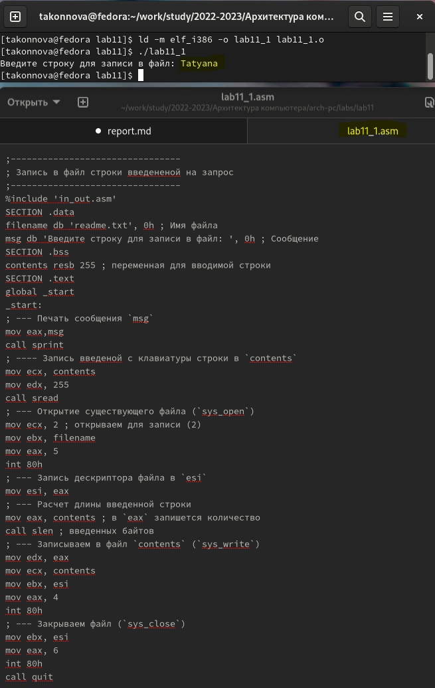

---
## Front matter
title: "Лабораторная работа №11"
subtitle: "Работа с
файлами средствами Nasm"
author: "Татьяна Алексеевна Коннова, НПИбд-01-22"

## Generic otions
lang: ru-RU
toc-title: "Содержание"

## Bibliography
bibliography: bib/cite.bib
csl: pandoc/csl/gost-r-7-0-5-2008-numeric.csl

## Pdf output format
toc: true # Table of contents
toc-depth: 2
lof: true # List of figures
fontsize: 12pt
linestretch: 1.5
papersize: a4
documentclass: scrreprt
## I18n polyglossia
polyglossia-lang:
  name: russian
  options:
	- spelling=modern
	- babelshorthands=true
polyglossia-otherlangs:
  name: english
## I18n babel
babel-lang: russian
babel-otherlangs: english
## Fonts
mainfont: PT Serif
romanfont: PT Serif
sansfont: PT Sans
monofont: PT Mono
mainfontoptions: Ligatures=TeX
romanfontoptions: Ligatures=TeX
sansfontoptions: Ligatures=TeX,Scale=MatchLowercase
monofontoptions: Scale=MatchLowercase,Scale=0.9
## Biblatex
biblatex: true
biblio-style: "gost-numeric"
biblatexoptions:
  - parentracker=true
  - backend=biber
  - hyperref=auto
  - language=auto
  - autolang=other*
  - citestyle=gost-numeric
## Pandoc-crossref LaTeX customization
figureTitle: "Рис."
listingTitle: "Листинг"
lofTitle: "Список иллюстраций"
lolTitle: "Листинги"
## Misc options
indent: true
header-includes:
  - \usepackage{indentfirst}
  - \usepackage{float} # keep figures where there are in the text
  - \floatplacement{figure}{H} # keep figures where there are in the text
---

# Цель работы

Приобретение навыков написания программ для работы с файлами.
## Задание  

Знакомство с подпрограммами

## Выполнение лабораторной работы 

1. Создаем каталог для программам лабораторной работы No 11, перейдем
в него и создаем файл lab11-1.asm и readme.txt:

mkdir ~/work/arch-pc/lab11  

cd ~/work/arch-pc/lab11   

touch lab11-1.asm readme.txt   

2. Введем в файл lab11-1.asm текст программы из листинга 11.1 (Программа
записи в файл сообщения). Создаем исполняемый файл и проверяем его
работу.
(рис. [-@fig:001])

{ #fig:001 width=100% }

3. и 4. С помощью команды chmod изменяем права доступа к исполняемому файлу
lab11-1, запретив его выполнение. Попытаемся выполнить файл. Объяс-
няем результат ниже.

Объяснение:  

Файл запускаем и также терминал способен выполнить его содержимое как команды. Однако при попытке исполнить lab11_1 отказывается в доступе, так как мы сами запретили выполнение его для всего.    
   
 С помощью команды chmod изменяем права доступа к файлу lab11-1.asm с
исходным текстом программы, добавив права на исполнение. Попытаемся
выполнить его и объяснить результат ниже. (рис. [-@fig:002])

{ #fig:002 width=100% }   
Объяснение: 

Файл запускается и терминал пытается выполнить его содержимое как консольные команды.
Документ я назвала вместо readme.txt document.txt   (рис. [-@fig:003])

{ #fig:003 width=100% }  

5. Предоставим права доступа к файлу document.txt в соответствии с вари-
антом в таблице 11.4. Проверим правильность выполнения с помощью
команды ls -l.(рис. [-@fig:004])

{ #fig:004 width=100% }

##  11.5. Задание для самостоятельной работы   

1. Напишите программу работающую по следующему алгоритму:
• Вывод приглашения “Как Вас зовут?”
• ввести с клавиатуры свои фамилию и имя
• создать файл с именем name.txt
• записать в файл сообщение “Меня зовут”
• дописать в файл строку введенную с клавиатуры
• закрыть файл
Создать исполняемый файл и проверить его работу. Проверить наличие файла
и его содержимое с помощью команд ls и cat.   

  У меня вариант 15: -wx --x rwx или 010 101 010.   (рис. [-@fig:005])

{ #fig:005 width=100% }

# Выводы
Приобретены навыки написания программ для работы с файлами.
